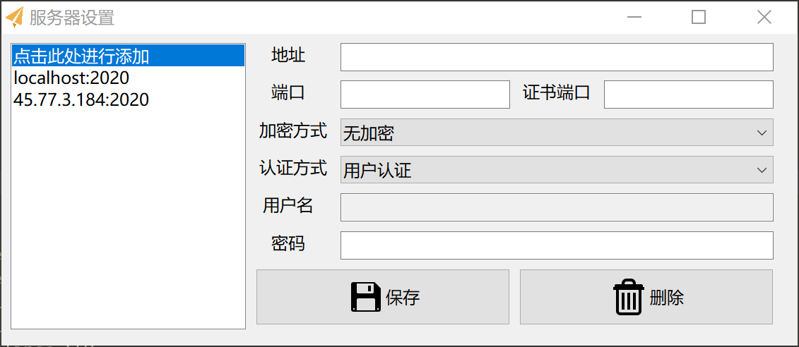
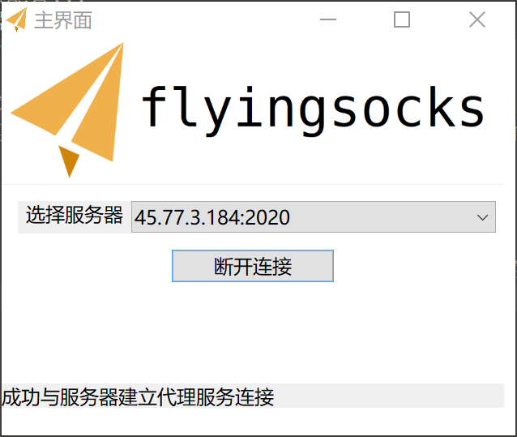

## 介绍
该项目是基于Java Netty开发的Socks5代理客户端/服务器，功能类似于Shadowsocks，个人认为性能比Shadowsocks稍好。<br/>

在客户端与服务端的数据传输上，我们选择了SSL/TLS单向认证的加密方式。服务端需要持有CA证书、签名请求以及PKCS8格式的密钥，客户端则需要持有服务端的CA证书。<br>
项目基于Maven构建，分为三个模块：server/client/common模块。<br>

注意该项目客户端与Shadowsocks所采用的通信协议不兼容，需要自己部署该项目的服务端部分到境外服务器上。

## 免责声明
该软件仅供个人学习使用，严禁使用该软件从事任何违法行为，所造成的后果本人不负责任。

## v2.0更新内容
##### 服务端
- 目标服务器构建/转发模块多线程化，根据服务器具体配置调整线程数量，提高服务器吞吐量
- 新增一个端口专门用于接收/验证SSL证书，保证自签证书也能够用于服务器和客户端的SSL通信
- 新增配置文件命令行工具，可通过该工具添加/删除/查看服务器的具体配置
- UDP代理(有待进一步测试)
- 优化与客户端的通信协议，减少带宽占用(注意：v2.0客户端与v1.0服务器不兼容)

##### 客户端
- 添加白名单代理模式，可自动识别目标服务器是否是境外服务器
- 自动缓存SSL证书，无需手动添加证书
- GUI界面改善，采用SWT框架，适应不同的操作系统环境
- 基于Socks5的UDP代理(有待进一步测试)
- 代码结构优化，BUG修复

## 服务端安装/部署
#### 基本要求
1. 必须安装JRE/JDK 1.8
2. 如果没有SSL证书，需要安装OpenSSL
3. 至少512MB系统运行内存

#### Linux 操作系统
1. 解压项目文件
2. 在bin目录下，执行`config-file-tool.sh`脚本：
    ````bash
    ./config-file-tools.sh -create
    ````
    按照提示配置好服务器配置，配置文件会构建在`/etc/flyingsocks-server/config.json`文件中，一般来说配置文件格式如下：
        
        [
          {
            "name": "default",
            "port": 2020,
            "cert-port": 7060,
            "max-client": 10,
            "encrypt": "OpenSSL",
            "auth-type": "simple",
            "password": "123456"
          }
        ]
        
    <br>
        config.json格式为JSON数组字符串，每个数组元素可单独绑定一个端口并单独指定加密方式和认证方式。其中，name为节点名称（可任意取名），port为端口，max-client为这个节点最大的客户端连接数，encrypt为加密方式（目前仅支持OpenSSL和不加密(生产环境不要用)），auth-type为认证方式。<br>
        认证方式目前仅支持simple和user两种方式<br>
        如果选择为simple方式，那么仅需在上述文件中追加password字段即可。<br>
        如果选择为user方式，那么需要追加group字段，group字段的含义是用户组名称，用户组则需要额外的user.json配置文件。<br>
        user.json文件格式如下：<br>
        
        [
          {
            "group": "default",
            "user": [
              {
                "user": "lzf",
                "pass": "abc123"
              }, {
                "user": "4399",
                "pass": "123456"
              }
            ]
          }
        ]	
        
    <br>
        user.json为一个JSON数组字符串，可同时指定多个用户组。<br>
        每个用户组包含两个字段：group字段和user字段。group字段表示该用户组的名称，在config.json配置文件中如果指定了一个节点的认证方式为USER方式，那么就需要指定用户组名了。user字段为JSON数组，每个数组元素表示一个用户，每个用户包含用户名及其密码。
        后续版本可能会推出用户管理API、用户流量控制等。目前用户认证和简单认证效果是一样的。

3. 在/var/log目录下建立flyingsocks-server文件夹：<br>
	`mkdir /var/log/flyingsocks-server`<br>
	该文件夹用于记录flyingsocks服务器的日志信息 <br>
	
	如果需要修改日志存储路径，可在bin目录下执行命令行工具`log-tool.sh`：
	````bash
	./log-tool.sh -path ../conf/log4j.properties -folder <your log path> -level INFO
	````
	参数`-path`用来指定`log4j.properties`文件的位置，`-folder`参数为你想修改的日志存储路径，`-level`为日志等级，一般为`INFO`或`WARN`即可。

4. 解压项目文件：<br>
	`unzip flyingsocks-server-1.0.zip`<br>
	`cd flyingsocks-server-1.0`<br>
	进入conf目录，修改log4j.properties文件的`log4j.appender.ROLLING_FILE.File`和`log4j.appender.DAILY_ROLLING_FILE.File`配置项，将前者改为/var/log/flyingsocks-server/rolling.log，后者改为/var/log/flyingsocks-server/daily.log。
	
	在conf下建立encrypt文件夹，执行openssl-tool.sh生成SSL证书（如果没有安装OpenSSL请自行安装），在执行过程中会输入一些证书信息。然后将产生的private.key和ca.crt拷贝到encrypt目录（不要修改文件名）。

5. 进入项目bin目录：<br>
	`chmod 770 startup.sh` <br>
	`./startup.sh -daemon`<br>
	这样项目就启动了。可以去日志目录下看看最后一行是不是flyingsocks server v1.0 start complete。
	如果启动正常但是客户端无法连接的话看看防火墙有没有设置好


#### Windows 操作系统
Windows安装方式和Linux大致类似，只不过建立的文件夹路径不同（废话）<br>
首先在C盘的ProgramData目录（一般是隐藏的）下建立文件夹flyingsocks-server，进入该文件夹然后新建log目录。<br>
C:/ProgramData/flyingsocks-server负责存储config.json和user.json配置文件，log目录负责存储日志文件。<br>
设置好后按照Linux的方式配置好运行startup.bat就行了。<br>


## 客户端安装
#### 基本要求
需要安装JRE/JDK 1.8

#### Linux/Mac 操作系统
1. 在/etc目录下建立flyingsocks-cli文件夹：<br>
	`mkdir /etc/flyingsocks-cli`<br>
2. 在/var/log目录下建立flyingsocks-cli文件夹<br>
	`mkdir /var/log/flyingsocks-cli`<br>
3. 解压客户端项目：<br>
	`unzip flyingsocks-client-1.0.zip`<br>
	`cd flyingsocks-client-1.0.zip`<br>
	修改conf目录下的log4j.properties的`log4j.appender.ROLLING_FILE.File`和`log4j.appender.DAILY_ROLLING_FILE.File`配置项，前者改为/var/log/shadowsocks-cli/rolling.log，后者改为/var/log/shadowsocks-cli/daily.log。<br>
4. 进入bin文件夹:
	`chmod 770 startup.sh` <br>
	`./startup.sh -daemon`<br>
	这样客户端就成功启动了，在系统托盘中可以看到小飞机图标，右键该图标即可打开菜单。<br>

	如果不需要GUI界面，可以去/etc/flyingsocks-cli目录下修改config.json文件，将JSON字符串的gui字段改为false，然后手动配置config.json指定需要连接的flyingsocks服务器。

#### Windows 操作系统
1. 在C:/ProgramData下建立shadowsocks-cli文件夹，进入该文件夹后创建log子文件夹。
2. 解压项目文件（任意目录）
3. 进入bin目录，双击运行startup.bat启动项目。


## 客户端使用说明
#### 添加代理服务器
1. 右键托盘图标，选择“编辑服务器配置...”
2. 左侧栏点击“点击此处添加服务器配置”,如图：


3. 输入服务器相关配置。基本配置为服务器地址（IP地址或者域名）及其代理端口（默认为2020）。
如果采用OpenSSL加密，则需要指定其证书端口。此外如果认证方式是用户认证，需要输入用户名及其密码，普通认证仅需要输入密码即可。
输入完成后，点击保存即可。在应用程序正常退出时，这些配置会保存在电脑上。


#### 连接到代理服务器
右键托盘图标，选择“打开主界面”，选择刚才配置好的界面，点击连接即可。下方状态栏如果显示“成功与代理服务器建立连接”则代表连接建立成功。


#### 代理模式
flyingsocks提供了四种代理模式，可通过右键托盘图标，在“代理模式”子菜单中选择。各个代理模式作用如下：
1. “不代理”，即所有代理连接都是直连，该模式无需连接到代理服务器。
2. “GFWList模式”，即所有在GFWList名单中的域名（不包含IP地址）都通过代理服务器建立连接，不在名单中的由本地直连。可在用户配置目录下的pac.txt中指定，默认已经包含5000余条记录。
域名的DNS解析都由代理服务器管理，不存在DNS污染问题。
3. “仅代理境外地址”，即所有境外服务器都通过代理服务器建立连接。DNS解析在本地完成，所以可能会存在DNS污染问题。
4. “全局模式”，所有代理请求都由代理服务器完成，包括国内网站，不存在DNS污染问题。

#### 全局代理
如果需要将所有代理连接转发到该

## 使用的框架
- Netty 4.1.36 Final
- slf4j 1.7.26 / Apache log4j
- Alibaba FastJSON 1.2.57
- Eclipse SWT 4.2

## 最后
如果在使用过程中有任何BUG可以在ISSUE中提出，或是提供修复的Pull Request，谢谢大家的支持